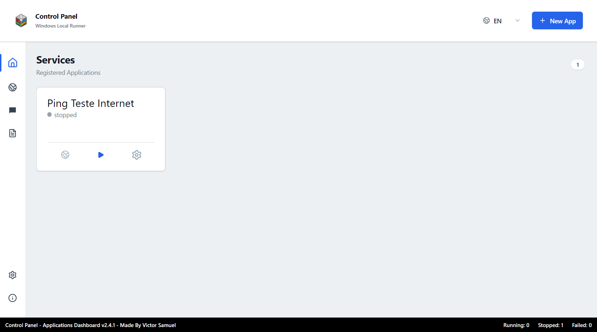
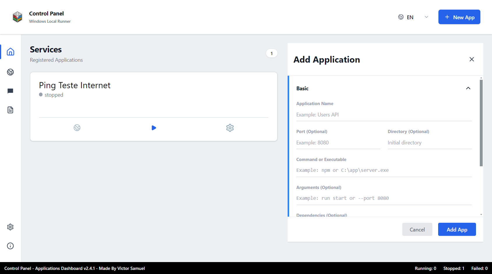
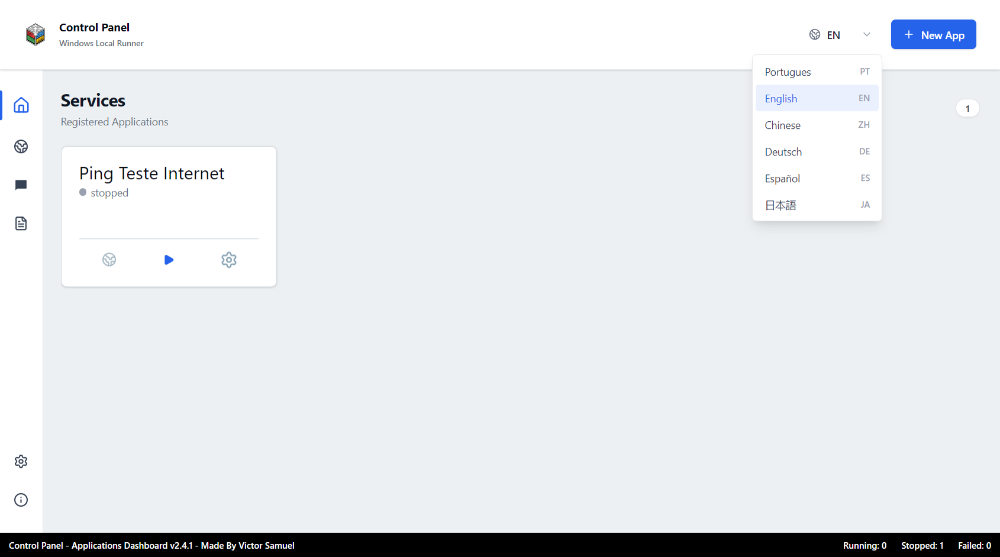
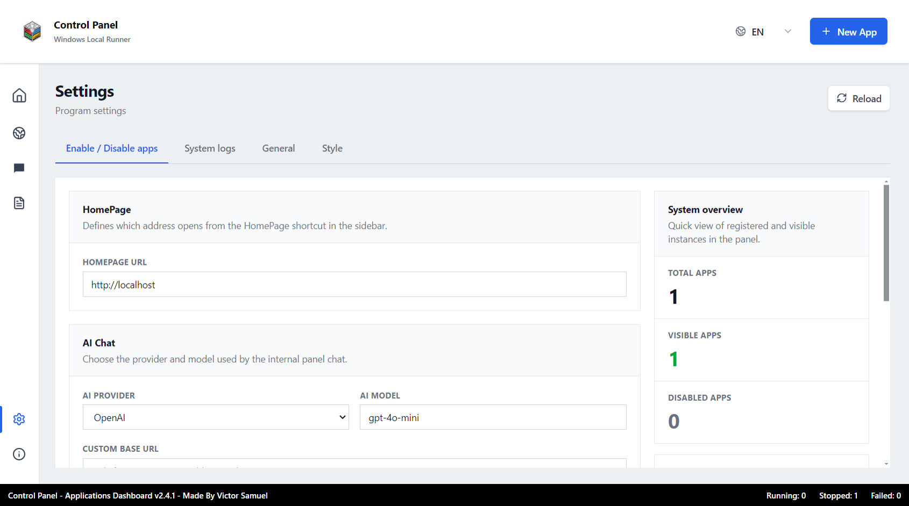
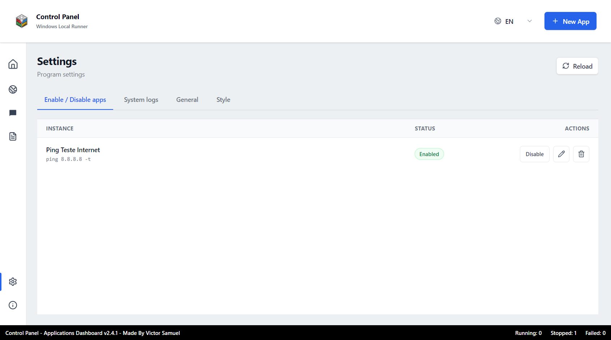
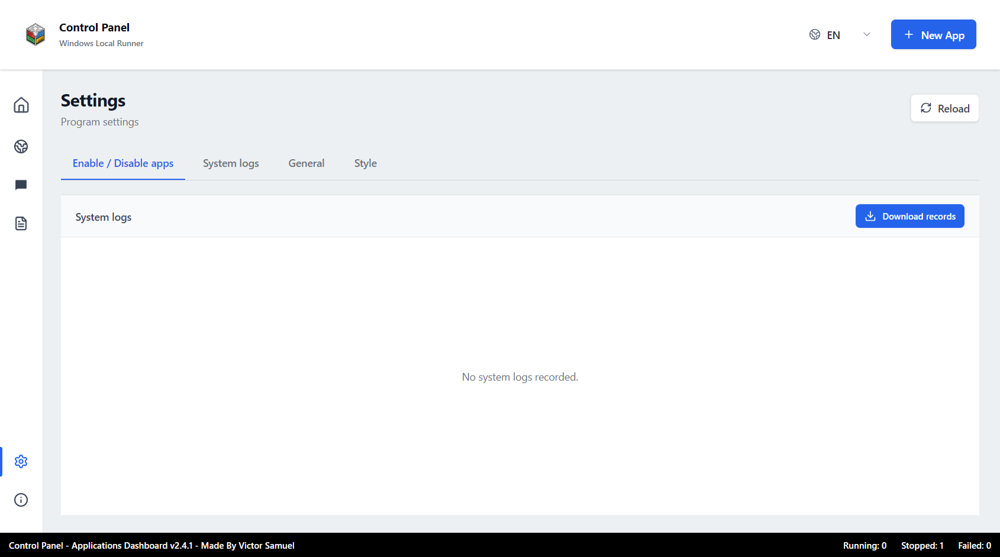
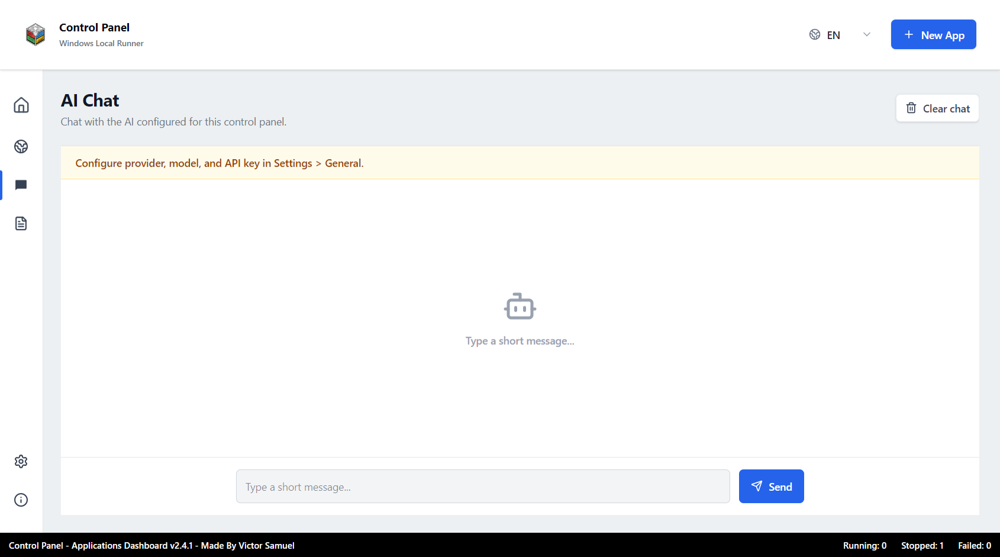
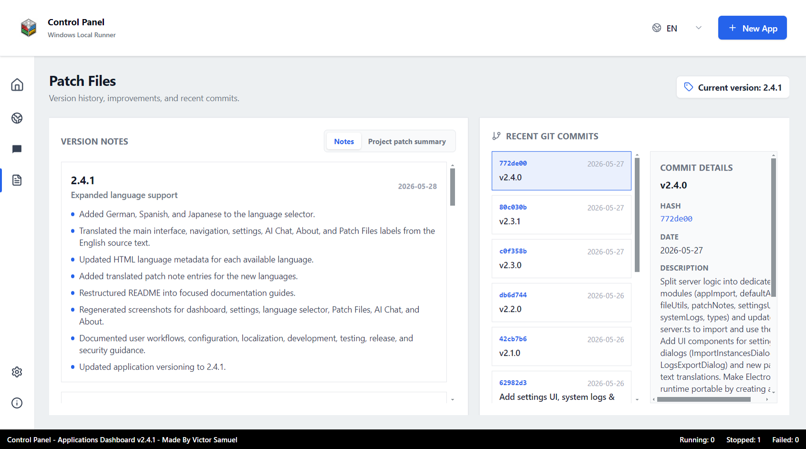
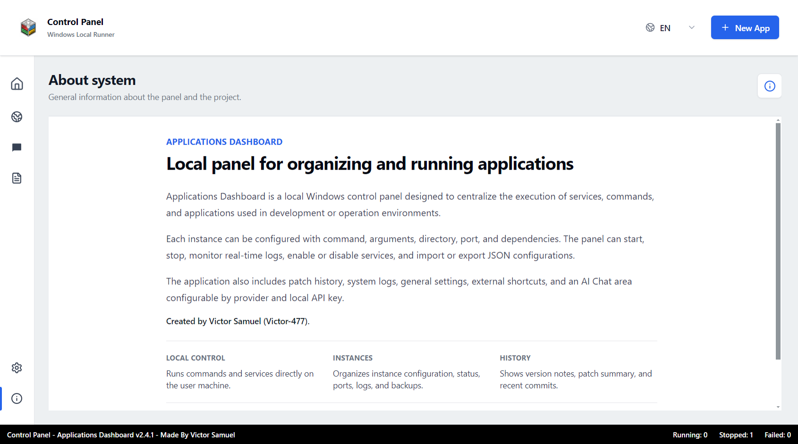

# User Guide

This guide explains the visible parts of Applications Dashboard and the main workflows available to users.

## Dashboard

The dashboard is the main page. Each configured instance appears as a card.

Each card shows:

- Instance name.
- Current status.
- Open HomePage shortcut, when the instance has a port or URL-related action.
- Start or stop action.
- Edit action.

Clicking a card selects it and opens the terminal/log panel beside the card list when logs are available.

## Creating or Editing an Instance

Use **New App** to create an instance. Use the gear icon on a card or the edit action in Settings to edit one.

Basic settings include:

- Name.
- Command or executable.
- Arguments.
- Port.
- Working directory.
- Dependencies.
- Shell execution mode.

Advanced settings include:

- Alternative ports.
- Secondary directory.
- Advanced command and arguments.
- Advanced shell mode.

Advanced settings must be enabled during creation. They are locked after the instance is created to preserve stability.

## Language Selector

The language selector is in the top bar. The default language is English.

Available languages:

- English.
- Portuguese.
- Chinese.
- German.
- Spanish.
- Japanese.

The selected language is stored locally and is restored when the app is reopened.

## Sidebar

The sidebar provides quick access to the main pages:

- **Home**: returns to the service dashboard.
- **HomePage**: opens the configured HomePage URL in the user's browser.
- **AI Chat**: opens the local AI chat page.
- **Patch Files**: shows version notes and Git commit details.
- **Settings**: opens system and instance settings.
- **About system**: shows project information and GitHub links.

## Settings

### General Settings

The General tab is divided into categories:

- **HomePage**: URL opened by the HomePage sidebar button.
- **AI Chat**: provider, model, base URL, and API key.
- **Instance settings**: JSON import and backup download.
- **System overview**: total, visible, and disabled instances.

API keys are saved only in local settings and are not sent to the browser.

### Style Settings

The Style tab controls:

- Light or dark theme.
- Accent color presets.
- Custom accent color using a six-character hexadecimal color code.

When a custom color is too light, the app adjusts button text contrast for readability.

### System Logs

The System logs tab records important dashboard events, such as:

- Instance creation.
- Instance updates.
- Start and stop actions.
- Import and backup actions.
- Errors.

Logs are always stored in English to keep exports consistent across interface languages.

Export formats:

- CSV.
- TXT.
- JSON.
- NDJSON.
- LOG.

The export dialog can filter by instance, limit the number of records, choose a format, and clear exported logs after download.

### Enable / Disable Apps

The Enable / Disable Apps tab lists all configured instances.

From this tab users can:

- Enable or disable an instance.
- Edit an instance.
- Remove an instance.

Disabled instances do not appear on the main dashboard.

## AI Chat

AI Chat is a simple chat page that uses the provider configured in Settings.

Supported provider modes:

- OpenAI.
- Google Gemini.
- Anthropic.
- OpenAI-compatible API.

The server limits the conversation context sent to the provider to reduce unnecessary token usage.

## Patch Files

Patch Files contains:

- Release notes from `patch-notes.json`.
- Project patch summary from `PROJECT_PATCH_SUMMARY.md`.
- Recent Git commits when available.

Click a commit to read its hash, date, subject, and description.

## About System

The About page explains the purpose of the application and includes:

- Main project description.
- Local control summary.
- Instance management summary.
- Patch history summary.
- GitHub profile link.
- Repository link.
- Created by Victor Samuel / Victor-477.
